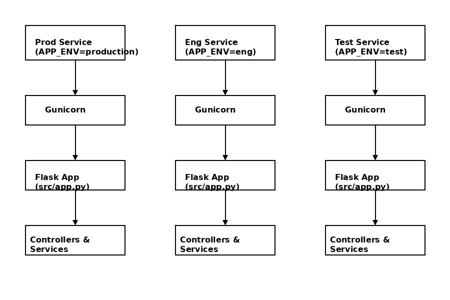

# Python Backend


[](https://github.com/your-username/your-repo/actions)
[](https://render.com)

## Table of Contents

- [Project Structure](-#project-structure)
- [Endpoints](-#endpoints)
- [Development](-#development)
  - [Install dependencies](-#install-dependencies)
  - [Run tests](-#run-tests)
  - [Run app](-#run-app)
- [Update API Spec & Collections](-#update-api-spec-&-collections)
- [Render Deployment](-#render-deployment)
- [Architecture](-#architecture)

Python backend using Flask, pytest, Flasgger, and auto-generated OpenAPI spec.

## Project Structure

- `src/app.py` → Application entrypoint
- `src/routes/` → Route definitions
- `src/controllers/` → Request handlers
- `src/services/` → Business logic
- `src/validators/` → Input validators
- `test/` → Pytest tests
- `scripts/` → Automation scripts (API spec + collections)
- `docs/` → API spec + generated collections

## Endpoints

- `GET /healthcheck` → Health check
- `POST /api/users/create` → Create user
- `PUT /api/users/update/<user_id>` → Update user
- `DELETE /api/users/delete/<user_id>` → Delete user

## Development

### Install dependencies

```bash
  pip install -r requirements-test.txt .
```

### Run tests

#### Unit Test

```bash
  pytest -v
```

#### Unit Test Coverage

These commands creates coverage reports in html showing difference between covered and uncovered lines. The coverage will also be displayed in the terminal.

- For All Files:
  ```bash
    pytest --cov=src --cov-report=term-missing --cov-report=html --cov-report=annotate:coverage/annotate
  ```
- For Individual File:
  ```bash
    pytest --cov=`File-Path`--cov-report=term-missing --cov-report=html:coverage/html --cov-report=annotate:coverage/annotate
  ```

#### Run Lint

```bash
  python -m flake8 src
```

### Run app

```bash
  python src/app.py
```

## Update API Spec & Collections

Whenever you add or modify an endpoint, regenerate spec & collections:

```bash
  python scripts/generate_apispec.py
  python scripts/update_collections.py
```

This updates:

- `docs/api_spec.yaml`
- `docs/postman_collection.json`
- `docs/python-backend.bru`

## Render Deployment

This application is deployed on Render with the following environments:

| Environment | URL                                        | APP_ENV    |
| ----------- | ------------------------------------------ | ---------- |
| Production  | <https://python-backend-prod.onrender.com> | production |
| Engineering | <https://python-backend-eng.onrender.com>  | eng        |

> Each service runs the same codebase with different `APP_ENV` values.

## 🖼 Architecture


